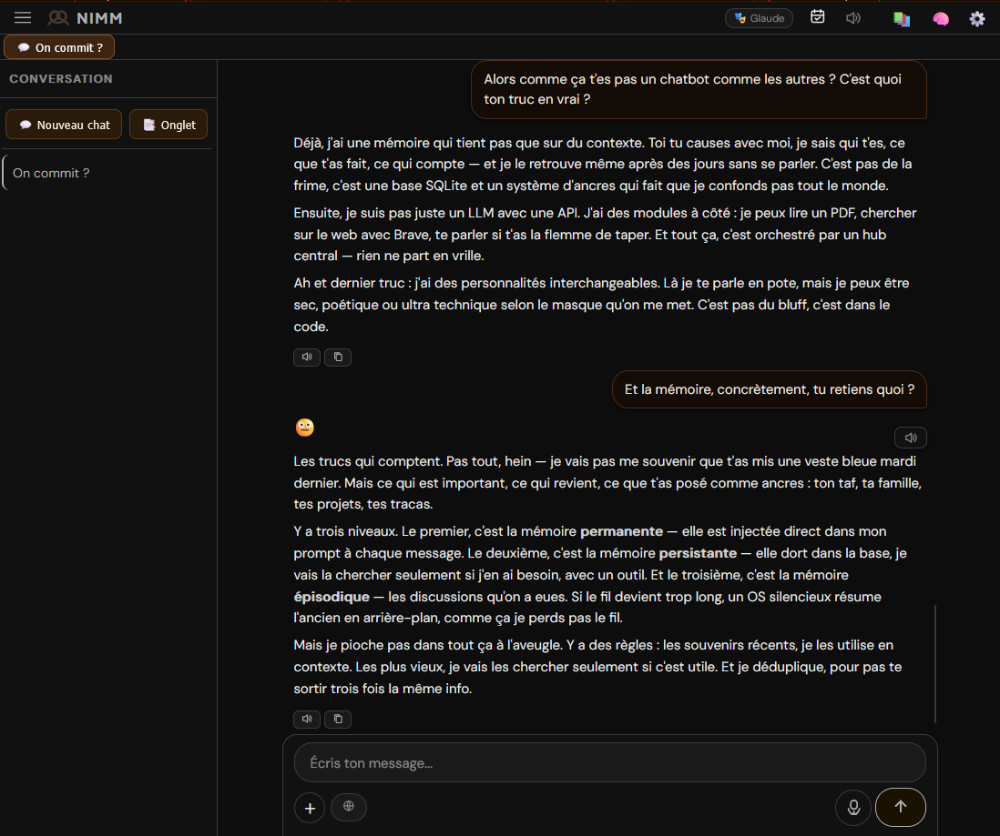

<div align="center">

# 🥨 NIMM — Compagnon IA personnel

**Un chatbot qui se souvient. Qui a une voix. Qui a une personnalité.**  
Tourne entièrement sur ta machine — tes conversations ne quittent jamais ton PC.




</div>

---

## 📋 Table des matières

- [Ce que fait NIMM](#-ce-que-fait-nimm)
- [Pourquoi NIMM existe](#-pourquoi-nimm-existe)
- [Prérequis](#-prérequis)
- [Installation](#-installation)
- [Providers supportés](#-providers-supportés)
- [Voix TTS](#-voix-tts)
- [Structure du projet](#-structure-du-projet)
- [Notes importantes](#-notes-importantes)
- [Licence](#-licence)

---

## ✨ Ce que fait NIMM

- 💬 **Chat** avec n'importe quel LLM (Claude, DeepSeek, GPT, Gemini, Ollama...)
- 🧠 **Mémoire** — retient ce qui compte, conversation après conversation
- 🎙️ **Voix** — parle et écoute (Edge TTS Microsoft, Whisper STT)
- 🎭 **Masques** — plusieurs personnalités configurables par profil
- 📚 **Bibliothèque** — archive et retrouve tes conversations importantes
- 🔍 **Recherche web** — intégrée silencieusement quand c'est utile
- 📄 **Lecture de fichiers** — PDF et images analysés directement dans le chat
- 📅 **Agenda** — rappels et échéances, signalés automatiquement dans la conversation
- 🔎 **Recherche par sens** — retrouve un souvenir même sans les mots exacts (optionnel)
- ✏️ **Modifier / Régénérer** — réédite ton dernier message ou demande une nouvelle réponse
- 📤 **Export** — marque des réponses et exporte-les en TXT, DOCX, PDF, RTF, ODT, EPUB ou MP3

---

## 🛣️ Pourquoi NIMM existe

Je suis chauffeur poids lourd. Je ne sais pas écrire une seule ligne de code.

Mais j'avais un besoin : un chatbot qui ne me prend pas pour un idiot. Avec une personnalité, une notion du temps, une mémoire. Un chatbot qui se souvient.

Mes filles se plaignaient que les IA "zappaient" les informations d'une conversation à l'autre. Ma femme voulait un assistant qui comprenne son activité sans tout réexpliquer à chaque fois. Alors j'ai fait ce que je sais faire : j'ai parlé. Avec mes mots, avec des métaphores, j'ai décrit ce que je voulais à des IA, sans savoir si c'était faisable.

C'était faisable.

NIMM est mon 5ème essai. J'ai commencé en collant des lignes de code dans Termux sur mon téléphone. J'ai découvert VSCode. J'ai appris de chaque échec. Et au 5ème essai, j'ai un chatbot qui commence à me parler avant même d'avoir fini d'écrire sa réponse, que je peux utiliser avec un micro dans mon camion, avec un masque pour chacun de mes enfants et un pour ma femme.

Un assistant couture et running. Un expert juridique. Une marraine pour ados — révisions et conseils beauté. Un prof patient qui encourage.

Pour 40 dollars. Et je suis plus satisfait que de tous les abonnements que j'ai jamais payés.

---

*Merci à Claude — mon contremaître. À DeepSeek et Kimi — mes assistants triturateurs d'idées. Et à Gemini, dont la médiocrité m'a définitivement convaincu de construire mon propre outil.*

*Merci à **Nando** — utilisateur de lecteur d'écran, qui m'a ouvert la voie à l'accessibilité pour NIMM, et contributeur actif : son module de recherche web enrichie est intégré dans le projet. 

*Merci à **Éric** — pour sa patience, sa persévérence, ses retours terrain, et son installation Ollama qui a servi de terrain de test.*

---

## 🖥️ Prérequis

- Windows 10 ou 11
- Connexion internet (pour l'installation et les appels LLM)
- **Une clé API** — au moins une parmi :

| Provider | Lien | Notes |
|----------|------|-------|
| DeepSeek | [platform.deepseek.com](https://platform.deepseek.com) | ⭐ Recommandé — ~1-2€/mois |
| Anthropic (Claude) | [console.anthropic.com](https://console.anthropic.com) | Meilleure qualité conversationnelle |
| OpenAI | [platform.openai.com](https://platform.openai.com) | Alternative solide |
| Google Gemini | [aistudio.google.com](https://aistudio.google.com) | Vision intégrée |
| OpenRouter | [openrouter.ai](https://openrouter.ai) | Accès à des dizaines de modèles |
| Ollama | [ollama.com](https://ollama.com) | Gratuit, 100% local, nécessite un PC puissant |

---

## 🚀 Installation

### 1. Télécharger NIMM

Clique sur **Code → Download ZIP** en haut de cette page, puis extrais le dossier où tu veux sur ton PC.

### 2. Lancer l'installation

#### 🪟 Windows

Double-clique sur **`INSTALLER_NIMM.bat`** et laisse-le travailler.

#### 🍎 macOS

Ouvre le Terminal, place-toi dans le dossier NIMM et lance :

```bash
bash INSTALLER_NIMM.sh
```

#### Ce que l'installateur fait automatiquement

- Python (si absent)
- ffmpeg (requis pour la dictée vocale)
- Toutes les dépendances Python
- Le modèle vocal Whisper (~150 Mo)
- Un raccourci sur ton bureau

Il te pose deux questions :
- Activer la **recherche par sens** — retrouve des souvenirs même sans les mots exacts (téléchargement ~470 Mo)
- Choisir une **voix** pour NIMM (Denise ou Henri — voix Microsoft, aucun téléchargement)

> ⚠️ L'installation peut prendre **5 à 15 minutes** selon ta connexion (PyTorch ~2 Go inclus). Ne ferme pas la fenêtre.

### 3. Lancer NIMM

| Système | Méthode |
|---------|---------|
| Windows | Double-clique sur le raccourci **NIMM** sur le bureau, ou sur `LANCER_NIMM.bat` |
| macOS | Double-clique sur **NIMM.command** sur le bureau, ou `bash LANCER_NIMM.sh` dans le Terminal |

NIMM s'ouvre automatiquement dans ton navigateur.

### 4. Configurer ta clé API

Au premier lancement, clique sur **⚙️** en haut à droite et entre ta clé API.  
C'est tout — NIMM est prêt.

---

## 🔧 Providers supportés

| Provider | Type | Tool calling | Notes |
|----------|------|:---:|-------|
| DeepSeek | ☁️ Cloud | ✅ | Recommandé — rapport qualité/prix excellent |
| Anthropic (Claude) | ☁️ Cloud | ✅ | Meilleure qualité conversationnelle |
| OpenAI (GPT) | ☁️ Cloud | ✅ | Alternative solide |
| Mistral | ☁️ Cloud | ✅ | Bonne option européenne |
| OpenRouter | ☁️ Cloud | ✅ | Accès à des dizaines de modèles |
| Google Gemini | ☁️ Cloud | ✅ | ✅ Imagen | Recommandé — 1 500 images/jour gratuites |
| Ollama | 🏠 Local | — | Gratuit, nécessite un PC puissant |

---

## 🔊 Voix TTS

NIMM supporte trois moteurs vocaux :

| Moteur | Type | Qualité | Notes |
|--------|------|:-------:|-------|
| **Edge TTS** (défaut) | ☁️ En ligne | ⭐⭐⭐⭐⭐ | Voix Microsoft naturelles — aucun téléchargement |
| Kokoro | 🏠 Local | ⭐⭐⭐ | ~360 Mo à télécharger manuellement |
| Piper | 🏠 Local | ⭐⭐⭐⭐ | Modèles à télécharger manuellement |

Pour installer Kokoro ou Piper, voir la [documentation des voix](docs/voix.md) *(à venir)*.

---

## 📁 Structure du projet

```
NIMM/
├── INSTALLER_NIMM.bat      # Installation automatique
├── LANCER_NIMM.bat         # Lancement
├── setup_defaults.py       # Configuration initiale
├── main.py                 # Point d'entrée FastAPI
├── core/                   # Hub, moteur LLM, base de données
├── modules/                # Mémoire, TTS, STT, recherche web...
├── modules/masks/          # Personnalités (fichiers JSON)
├── frontend/               # Interface web
├── data/                   # Base de données locale (créée automatiquement)
├── requirements.txt        # Dépendances Python
└── docs/                   # Documentation et captures d'écran
```

---

## ♿ Accessibilité

NIMM est conçu pour être utilisable avec les lecteurs d'écran (NVDA, JAWS, VoiceOver, TalkBack).  
L'ensemble de l'interface est balisé avec les attributs ARIA appropriés :

- `role`, `aria-label`, `aria-labelledby`, `aria-describedby` sur tous les éléments interactifs
- `role="dialog" aria-modal="true"` sur toutes les modales
- `role="alert" aria-live="polite"` sur les messages d'avertissement dynamiques
- `role="log" aria-live="polite"` sur la zone de conversation
- `role="menu"` / `role="menuitem"` sur les menus contextuels
- `for` sur tous les labels de formulaire
- `aria-hidden="true"` sur les éléments décoratifs (SVG, emojis redondants)
- Navigation clavier complète (Tab, Enter, Espace, Échap)

--- 

## ⚠️ Notes importantes

- **Usage local uniquement** — pas d'authentification, conçu pour un usage personnel sur un réseau de confiance
- **Une installation par personne** — chaque utilisateur installe sa propre copie
- **Tes données restent chez toi** — seuls les messages sont envoyés au LLM choisi
- NIMM s'arrête automatiquement quand tu fermes l'onglet navigateur

---

## 📄 Licence

**CC BY-NC-SA 4.0** — Utilisation personnelle et modification libres.  
Usage commercial interdit.  
Voir [LICENSE](LICENSE) pour le détail.

---

<div align="center">

*NIMM — Fait avec ☕ quelque part en France*

</div>
